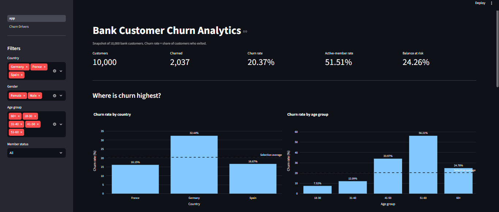
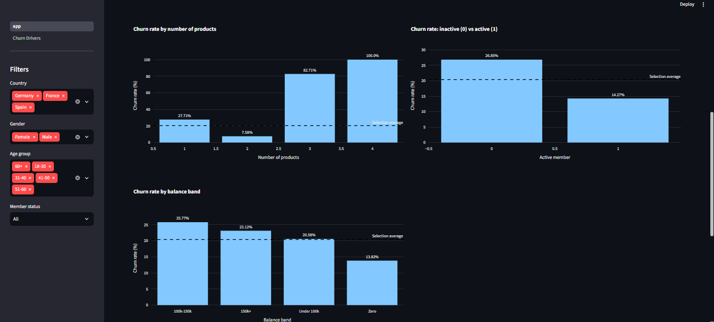
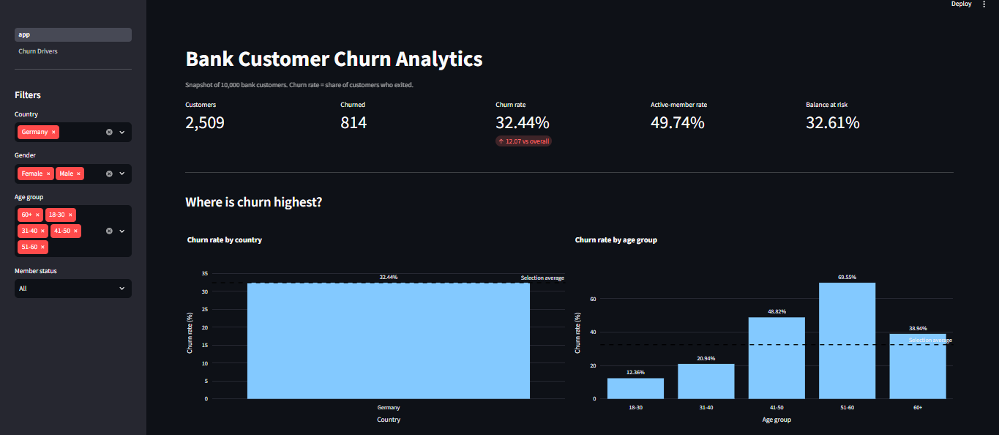
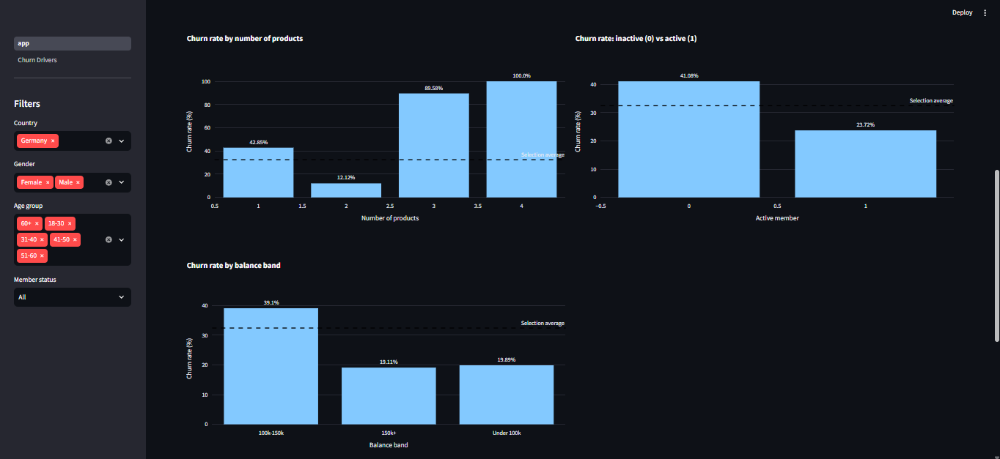
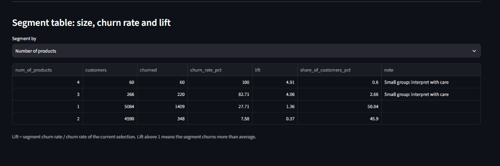
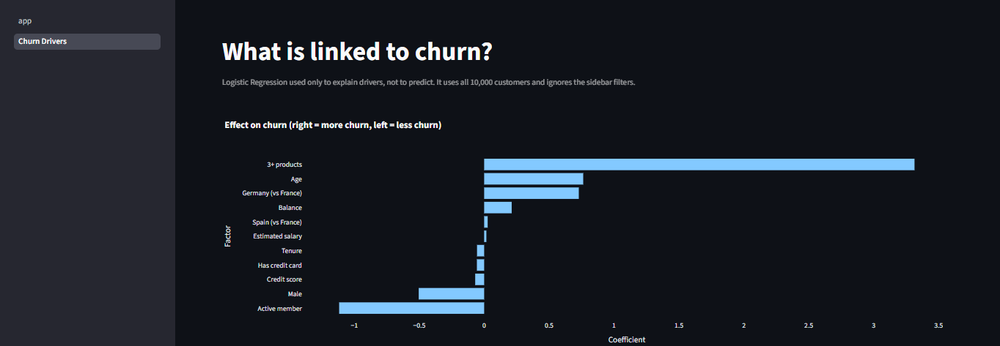
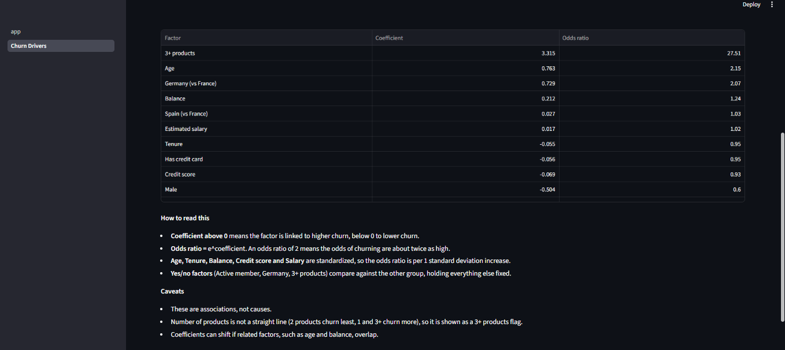

# Bank Customer Churn Analytics Dashboard

An interactive Streamlit dashboard that uses SQL-defined KPIs to show where a bank loses customers, and what a product team could do about it.

## Problem
A retail bank wants to know which customers churn, how much value leaves with them, and where retention effort should go first.

## Data
Public "Churn Modelling" dataset from Kaggle: 10,000 bank customers across France, Germany and Spain.
- Checked for nulls and duplicate customer IDs (none found).
- Dropped `RowNumber` and `Surname` (no analytic value; surnames are personal data).
- Added `age_group` and `balance_band`, because raw age and balance are too granular for dashboards.

**Limits:** the dataset is a single snapshot with no dates, so "churn rate" means the share of customers in the file who exited, not a monthly rate. It is also largely synthetic.

## Tech
Python, Pandas, SQLite (SQL KPIs), Streamlit, Plotly, scikit-learn (Logistic Regression for driver explanation only).

## KPIs
Full definitions are in [docs/kpi_definitions.md](docs/kpi_definitions.md).

| KPI | Formula | Why a product team cares | Caveat |
|---|---|---|---|
| Churn rate | churned / total customers | Headline retention metric | Snapshot, no trend |
| Segment churn rate and lift | segment rate / overall rate | Shows where to focus | Small segments are noisy, so size is shown next to every rate |
| Active-member rate and churn gap | active / total; inactive churn minus active churn | Engagement is an early warning sign | Inactivity may be a symptom, not only a cause |
| Churn by number of products | churn rate per product count | Tests whether cross-selling helps retention | Correlation only; 3 and 4 product groups are tiny |
| Balance at risk | churned balance / total balance | Weights churn by money | Many zero-balance customers; large accounts can dominate |

## Screenshots








## Findings
- **Overall churn is 20.37%** (2,037 of 10,000 customers).
- **Germany churns at 32.44%** (lift 1.59), about twice France (16.15%) and Spain (16.67%).
- **Age matters:** customers aged 51-60 churn at 56.21% (lift 2.76) and 41-50 at 33.97%, against 7.52% for ages 18-30.
- **Inactive members churn at 26.85%** versus 14.27% for active members, a gap of 12.58 points.
- **Number of products is not a straight line:** 2 products churn least (7.58%), 1 product 27.71%, and 3 or 4 products 82.71% and 100%. The 3 and 4 groups have only 266 and 60 customers, so these rates are a warning sign, not a precise estimate.
- **Churn costs more than its headcount suggests:** churned customers are 20.37% of customers but hold 24.26% of total balance, and their average balance is higher (91,109 vs 72,745).
- **Driver analysis (Logistic Regression, explanation only):** holding other factors fixed, 3+ products, older age and Germany are linked to higher churn, while being an active member is the strongest protective factor. Men have about 40% lower odds of churning than women. Salary, tenure, credit card and credit score show almost no effect. These are associations, not causes.

## Recommendations for a product team
1. **Re-activate inactive members** with engagement campaigns, since they churn at almost twice the rate of active members.
2. **Investigate the German market** (pricing, service, competition), since it has the highest churn and the highest balance at risk.
3. **Review the 3+ product experience**, since near-total churn there suggests a problem with how those products are sold or served.
4. **Target retention offers at customers aged 41-60**, who churn most and tend to hold larger balances.

## How to run
```
pip install -r requirements.txt
python clean_data.py
python load_db.py
streamlit run app.py
```
`churn.db` is not stored in the repo. It is generated by the two scripts above.

## Project structure
```
app.py                  Streamlit dashboard
kpis.py                 Parameterized SQL KPI functions
pages/1_Churn_Drivers.py  Logistic Regression driver page
clean_data.py           Cleaning and validation
load_db.py              Loads clean data into SQLite
sql/                    The KPI queries
docs/                   KPI definitions
screenshots/            Images used in this README
```